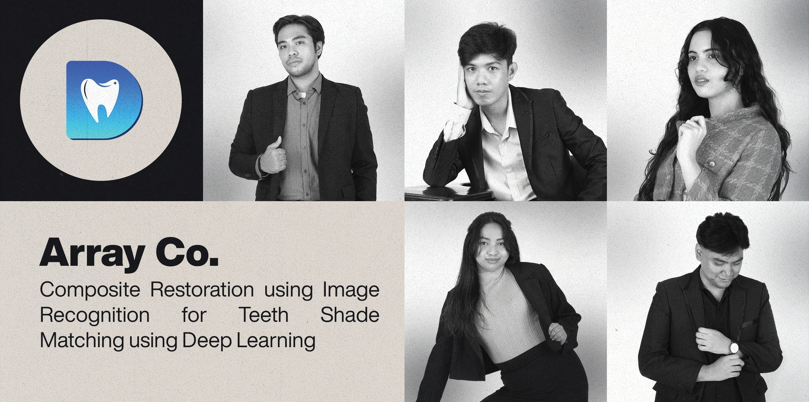

# DASH: Composite Restoration using Image Recognition for Teeth Shade Matching using Deep Learning

 

  

# Hi, we are Array Co. 👋
We are a group of researchers from **FEU Institute of Technology** under the course of *Bachelor of Science in Computer Science with Specialization in Software Engineering*.

**Array Co. Members:**
1. Jericho John O. Almoro
2. Francis Dale P. Cañon
3. Bianca H. Goldman
4. Micah Sophia Q. Tan
5. John Angelo B. Yap

 
# What is DASH? 
Array Co. developed an android applcation which addresses the variability of composite restoration in dentistry and orthodontics by standardizing the crucial step of shade matching using the CNN-based MediaPipe Facial Landmark Detection for object detection and Support Vector Machines for classification. The developed application achieved a remarkable 90% accuracy as validated by dentists, which significantly exceeds the peer-reviewed estimated 35% accuracy of traditional visual shade matching. Also, DASH stands for Dental Application for Shade Matching.

 
# Tools and Frameworks

